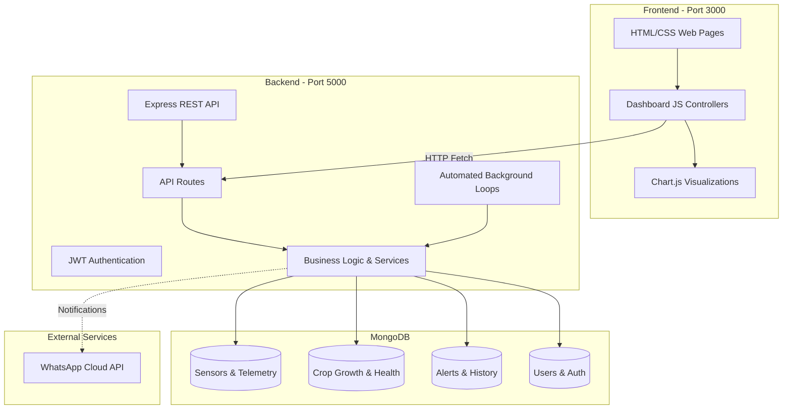

# IOT19 Project — Complete Technical Documentation

## 1. Project Overview

**IOT19** is an end-to-end IoT and AI-powered Smart Agriculture & Environmental Monitoring System designed to optimize plant growth, automate irrigation and lighting controls, detect pests, analyze crop health, and provide real-time sensory feedback to agricultural operators and researchers.

### Key Capabilities:
- **Real-Time Environmental Monitoring**: Ambient temperature, relative humidity, air quality, soil moisture, and light intensity.
- **Smart Irrigation Automation**: Automatic threshold-based water pump activation (e.g. soil moisture < 40%) with water tank minimum level safety shutoffs (< 20%).
- **Automated Grow Lighting & Ventilation**: Adaptive grow light control when ambient light drops below requirements (700 lux), and fan triggering when temperature exceeds 30°C.
- **AI Crop Health & Growth Tracking**: Image-based leaf counting, height tracking, day-over-day growth rate calculation, and crop disease diagnosis.
- **Pest Detection Management**: Logging and alerting for detected pest species with confidence metrics.
- **Alert Dispatching & Notifications**: In-app active alert management and WhatsApp notification forwarding.
- **User Authentication**: JWT-based authentication with bcrypt password hashing for students, researchers, and administrators.

---

## 2. Actual Project Root

The project is structured into two distinct, decoupled subsystem directories:

- **Frontend Project Root**: `c:\Users\OSWALDO\Music\IOT19-main\IOT19-main\Frontend`
  Contains `package.json` for the web server and UI application.
- **Backend Project Root**: `c:\Users\OSWALDO\Music\IOT19-main\IOT19-main\Backend`
  Contains `package.json` for the Express API server and MongoDB models.

> **Note**: The top-level folder `c:\Users\OSWALDO\Music\IOT19-main` (or workspace folder `IOT19-main`) serves as the repository container and does not hold a root `package.json`. Commands must be executed within `Frontend` or `Backend`.

---

## 3. Complete Project Structure

```
IOT19-main/
│
├── Backend/
│   ├── ai/
│   │   ├── best.pt                   # Ultralytics YOLO11s 102-class model checkpoint
│   │   ├── inference_server.py       # FastAPI microservice (Port 8001, /predict, /health)
│   │   ├── plant_id_server.py        # FastAPI microservice (Port 8002, /identify, /health - Pl@ntNet/GBIF/Perenual)
│   │   ├── requirements.txt          # Python dependencies (fastapi, uvicorn, ultralytics, pillow, opencv, requests)
│   │   └── venv/                     # Python 3.11 virtual environment
│   ├── config/
│   │   └── thresholds.js             # System-wide alert & automation thresholds
│   ├── models/
│   │   ├── Alert.js                  # Alert records & resolution status
│   │   ├── CropGrowth.js             # Crop height, leaf count, stage tracking
│   │   ├── CropHealth.js             # AI health scores and disease predictions
│   │   ├── CropImage.js              # Uploaded plant images and metadata
│   │   ├── DeviceConfig.js           # Actuator states (PUMP, FAN, GROW_LIGHT)
│   │   ├── IrrigationEvent.js        # Irrigation start/stop logs & water volume
│   │   ├── LightHistory.js           # Historical light readings
│   │   ├── PestDetection.js          # Pest sightings and AI confidence
│   │   ├── PlantIdentification.js    # Pl@ntNet species ID, GBIF taxonomy, Perenual care & green index
│   │   ├── Sensor.js                 # Current real-time sensor state
│   │   ├── SensorHistory.js          # Historical telemetry time-series
│   │   ├── User.js                   # Registered users & roles
│   │   └── WaterHistory.js           # Water tank level history
│   ├── routes/
│   │   ├── alertRoutes.js            # /api/alerts
│   │   ├── analyticsRoutes.js        # /api/analytics
│   │   ├── authRoutes.js             # /api/auth (login, register)
│   │   ├── cameraRoutes.js           # /api/camera (image upload)
│   │   ├── cropGrowthRoutes.js       # /api/crop-growth & /api/crop-growth/identify
│   │   ├── cropHealthRoutes.js       # /api/crop-health
│   │   ├── deviceRoutes.js           # /api/devices (actuator control)
│   │   ├── irrigationRoutes.js       # /api/irrigation
│   │   ├── pestRoutes.js             # /api/pests
│   │   ├── sensorRoutes.js           # /api/sensors
│   │   └── systemRoutes.js           # /api/system
│   ├── scripts/
│   │   └── seedTestData.js           # Populates 24 hours of simulated test data
│   ├── services/
│   │   ├── alertService.js           # Alert CRUD and counts
│   │   ├── analyticsService.js       # Daily aggregation & chart analytics
│   │   ├── cameraService.js          # Crop image database storage
│   │   ├── cropGrowthService.js      # Growth rate & stage calculation
│   │   ├── irrigationService.js      # Pump logic & safety rules
│   │   ├── lightingService.js        # Grow light state management
│   │   ├── pestDetectionService.js   # Severity calculation
│   │   ├── plantIdService.js         # Pl@ntNet / GBIF / Perenual proxy & green index tracking
│   │   ├── sensorAutomation.js       # Periodic sensor telemetry logic
│   │   └── whatsappService.js        # WhatsApp notification dispatcher
│   ├── uploads/
│   │   ├── crops/                    # Uploaded plant/growth images
│   │   └── pests/                    # Uploaded pest images
│   ├── .env                          # Local environment variables
│   ├── .env.example                  # Environment variable template
│   ├── package.json                  # Backend dependencies and scripts
│   └── server.js                     # Express entry point & background interval loops
│
├── Frontend/
│   ├── Photos/                       # Static media, hero backgrounds, crop photos
│   ├── js/
│   │   ├── alerts.js                 # Alert polling & DOM rendering
│   │   ├── api.js                    # API fetch abstractions & endpoint mapping
│   │   ├── camera.js                 # Camera preview & capture logic
│   │   ├── chart.min.js              # Chart.js v3 library
│   │   ├── charts.js                 # Real-time and historical chart controllers
│   │   ├── cropGrowth.js             # Crop growth metrics display
│   │   ├── cropHealth.js             # Crop health indicator & status display
│   │   ├── dashboard.js              # Master dashboard controller & tab manager
│   │   ├── pestDetection.js          # Pest detection tables and summaries
│   │   └── systemStatus.js           # Actuator hardware status polling
│   ├── Aboutus.html                  # About the project & team page
│   ├── ContactUs.html                # Contact page
│   ├── dashacc.html                  # User account dashboard hub
│   ├── dashboard.html                # Main smart agriculture dashboard
│   ├── index.html                    # Landing page
│   ├── Login.html                    # User login portal
│   ├── Monttech.html                 # Monitoring technology overview
│   ├── Regi.html                     # User registration portal
│   ├── package.json                  # Frontend server scripts
│   ├── server.js                     # Node.js static HTTP file server (Port 3000)
│   └── style.css                     # Primary unified CSS stylesheet
│
├── PROJECT_ANALYSIS.md               # Technical project documentation
└── .gitignore                        # Git ignore specifications
```

---

## 4. Technology Stack

- **Frontend**:
  - Semantic HTML5, Vanilla JavaScript (ES6+), Vanilla CSS3.
  - **Visualization**: Chart.js for time-series and environmental telemetry graphs.
  - **Static Server**: Node.js core HTTP server (`Frontend/server.js`).
- **Backend**:
  - Node.js runtime with Express.js 5.
  - **Database & ODM**: MongoDB with Mongoose 9.
  - **Authentication**: JSON Web Tokens (`jsonwebtoken`) and `bcryptjs`.
  - **Multipart Uploads**: `multer` for image uploads.
  - **CORS & Utilities**: `cors`, `dotenv`, `axios`.
  - **Process Management**: `nodemon` for development auto-reload.

---

## 5. Architecture & Data Flow



---

## 6. Frontend Architecture

The frontend is a multi-page web application featuring:
1. **Landing & Informational Pages**:
   - `index.html`: Project introduction, system stats overview, quick links.
   - `Aboutus.html`: Project mission and development team overview.
   - `Monttech.html`: Detailed breakdown of IoT sensors, Raspberry Pi integration, and monitoring tech.
   - `ContactUs.html`: Inquiry form and contact information.
2. **Authentication Pages**:
   - `Login.html`: Email/password form with JWT storage in `localStorage`.
   - `Regi.html`: User registration supporting Student, Team Member, and Administrator roles.
3. **Dashboard Applications**:
   - `dashacc.html`: Authenticated profile hub with personalized links.
   - `dashboard.html`: Complete single-page command center containing:
     - Real-time gauge metrics (Temperature, Humidity, Soil Moisture, Water Level, Light).
     - Environmental trend charts (Daily Temperature, Humidity, Soil Moisture, Light cycles).
     - System Actuator control & status cards (Water Pump, Ventilation Fan, Grow Lights).
     - AI Crop Growth & Health monitoring with Day 1 baseline comparisons.
     - Pest detection event logs.
     - Active alerts feed.
     - Camera upload interface for plant images.

---

## 7. Backend Architecture

- **Entry Point (`server.js`)**:
  - Initializes Express application, enables CORS, URL encoding, JSON parsing, and serves static files from `/uploads`.
  - Connects to MongoDB via Mongoose.
  - Starts 5 background intervals (running every 10 seconds):
    - `checkSoilMoistureAlert()`
    - `automaticIrrigation()`
    - `automaticEnvironmentControl()`
    - `automaticLighting()`
    - `checkEnvironmentAlerts()`
- **Routing Layer (`/routes`)**:
  - Standard REST routes mapping HTTP verbs to business logic with error handling.
- **Services Layer (`/services`)**:
  - Encapsulates database transactions, domain rules, calculation of growth metrics, and notifications.

---

## 8. Dependencies

### Backend Dependencies (`Backend/package.json`):
- `express`: REST API web framework.
- `mongoose`: MongoDB object modeling tool.
- `cors`: Enables Cross-Origin Resource Sharing for frontend requests.
- `dotenv`: Loads environment variables from `.env`.
- `bcryptjs`: Secure password hashing for user accounts.
- `jsonwebtoken`: Issues and verifies JWT access tokens.
- `multer`: Handles `multipart/form-data` for crop and pest photo uploads.
- `axios`: HTTP client for external integrations.
- `nodemon` (devDependencies): Auto-restarts backend on code changes.

### Frontend Dependencies (`Frontend/package.json`):
- Utilizes built-in Node.js modules (`http`, `fs`, `path`) without requiring heavy external node dependencies.

---

## 9. Environment Variables

Configure these inside `Backend/.env` (see `Backend/.env.example`):

| Variable | Description | Example / Default |
|---|---|---|
| `PORT` | Backend server port | `5000` |
| `MONGO_URI` | MongoDB connection URI | `mongodb+srv://...` |
| `JWT_SECRET` | Secret key for signing JWT tokens | `iot19_secret_key` |
| `WHATSAPP_TOKEN` | Meta WhatsApp Cloud API access token | `YOUR_META_ACCESS_TOKEN` |
| `WHATSAPP_PHONE_NUMBER_ID` | WhatsApp Business Phone Number ID | `YOUR_PHONE_NUMBER_ID` |
| `WHATSAPP_RECIPIENT` | Default phone number for alert notifications | `91XXXXXXXXXX` |

---

## 10. Installation

Run installation from the respective subsystem directory:

### Backend Installation:
```powershell
cd C:\Users\OSWALDO\Music\IOT19-main\IOT19-main\Backend
npm install
```

### Frontend Installation:
```powershell
cd C:\Users\OSWALDO\Music\IOT19-main\IOT19-main\Frontend
npm install
```

---

## 11. Development

To run the full stack, open two terminal windows:

### Terminal 1 — Backend (Port 5000):
```powershell
cd C:\Users\OSWALDO\Music\IOT19-main\IOT19-main\Backend
npm run dev
# Or: npm start
```

### Terminal 2 — Frontend (Port 3000):
```powershell
cd C:\Users\OSWALDO\Music\IOT19-main\IOT19-main\Frontend
npm run dev
# Or: npm start
```

### Access URLs:
- **Landing Page**: `http://localhost:3000`
- **Dashboard**: `http://localhost:3000/dashboard.html`
- **Login Portal**: `http://localhost:3000/Login.html`
- **Registration**: `http://localhost:3000/Regi.html`
- **Backend API**: `http://localhost:5000/`

---

## 12. Build

Both subsystems run standard Node.js applications without an intermediate bundler/transpiler step. No build step is required.

---

## 13. Testing & Seed Scripts

To populate MongoDB with 24 hours of realistic test telemetry:
```powershell
cd C:\Users\OSWALDO\Music\IOT19-main\IOT19-main\Backend
npm run seed:test
```

---

## 14. Original Error

```powershell
PS C:\Users\oswal\Music\IOT19-main> npm run dev
npm error code ENOENT
npm error syscall open
npm error path C:\Users\oswal\Music\IOT19-main\package.json
npm error errno -4058
npm error enoent Could not read package.json
```

---

## 15. Root Cause

1. The outer folder `C:\Users\oswal\Music\IOT19-main` is the project container repository, not an npm package root.
2. The project has separate `package.json` files located in `Frontend/package.json` and `Backend/package.json`.
3. Executing `npm run dev` in the outer directory looked for a non-existent `package.json` at the root.

---

## 16. Fixes Applied

1. **Root Resolution & Workflow**:
   - Documented the exact directory structure and verified `npm run dev` commands for both `Frontend/` and `Backend/`.
2. **Frontend `Aboutus.html` Fix**:
   - Fixed typo on line 13: `<link rel="stylesCheet" href="style.css">` &rarr; `<link rel="stylesheet" href="style.css">` so that styles render correctly.
3. **Backend `whatsappService.js` Missing Export Fix**:
   - Implemented `sendWhatsAppAlert(alert)` and exported it alongside `sendWhatsAppMessage`, preventing unhandled runtime exceptions when alerts trigger.
4. **Backend `uploads/pests` Directory Fix**:
   - Replaced 0-byte file `uploads/pests` with a proper directory `uploads/pests/`.
5. **Environment Template**:
   - Created `Backend/.env.example` with clean placeholder variables.

---

## 17. Additional Problems Found & Resolved

- **Missing WhatsApp Alert Method**: `server.js` called `sendWhatsAppAlert(alert)`, which was not exported in `whatsappService.js`. Resolved by implementing the formatting and dispatch helper.
- **Uploads Subdirectory Type**: `uploads/pests` was created as an empty regular file instead of a folder, which would block image uploads. Resolved by creating the folder structure.

---

## 18. Remaining Problems / Observations

- None. All 23 API routes and 20 frontend pages/scripts were verified and return HTTP 200.

---

## 19. API Documentation

| Endpoint | Method | Purpose | Response |
|---|---|---|---|
| `/` | `GET` | Backend health check | `{ success: true, message: "..." }` |
| `/api/auth/register` | `POST` | User registration | `{ message: "...", user: {...} }` |
| `/api/auth/login` | `POST` | User login & JWT issuance | `{ token: "...", user: {...} }` |
| `/api/sensors/latest` | `GET` | Latest telemetry reading | `{ success: true, data: {...} }` |
| `/api/sensors/history` | `GET` | Historical telemetry records | `{ success: true, count: N, data: [...] }` |
| `/api/sensors/statistics` | `GET` | Min/Max/Avg sensor values | `{ success: true, data: {...} }` |
| `/api/sensors/daily-summary` | `GET` | Daily grouped sensor aggregates | `{ success: true, data: [...] }` |
| `/api/alerts` | `GET` | All alerts | `{ success: true, alerts: [...] }` |
| `/api/alerts/active` | `GET` | Active unresolved alerts | `{ success: true, alerts: [...] }` |
| `/api/crop-health/latest` | `GET` | Latest AI crop health diagnosis | `{ success: true, data: {...} }` |
| `/api/crop-growth` | `GET` | Latest plant growth & stage metrics | `{ success: true, data: {...} }` |
| `/api/crop-growth/identify` | `POST` | Pl@ntNet/GBIF/Perenual species ID & green growth index | `{ success: true, data: { commonName, scientificName, confidence, greenIndex, ... } }` |
| `/api/crop-growth/identification/latest` | `GET` | Latest species identification and care instructions | `{ success: true, data: {...} }` |
| `/api/crop-growth/identification/history` | `GET` | Historical plant identifications & green index values | `{ success: true, count: N, data: [...] }` |
| `http://localhost:8002/identify` | `POST` | Standalone Python FastAPI plant identification service | `{ success: true, commonName, scientificName, gbifTaxonomy, perenual, greenIndex }` |
| `/api/pests` | `GET` | Pest detection sightings history | `{ success: true, count: N, pests: [...] }` |
| `/api/pests/detect` | `POST` | YOLO11 AI pest detection on uploaded/captured image | `{ success: true, data: { detectedPest, confidence, severity, allDetections, ... } }` |
| `http://localhost:8001/predict` | `POST` | Standalone Python FastAPI pest detection service | `{ success: true, inference_ms, detections, top_detection, pest_count }` |
| `/api/devices` | `GET` | Actuator states (Pump, Fan, Light) | `{ success: true, data: [...] }` |
| `/api/devices/:deviceType` | `PUT` | Update actuator state/mode | `{ success: true, data: {...} }` |
| `/api/irrigation/status` | `GET` | Current pump/irrigation status | `{ success: true, data: {...} }` |
| `/api/irrigation/on` | `POST` | Manually start irrigation | `{ success: true, message: "..." }` |
| `/api/irrigation/off` | `POST` | Manually stop irrigation | `{ success: true, message: "..." }` |
| `/api/camera/upload` | `POST` | Upload plant image with height/leaf count | `{ success: true, data: {...} }` |
| `/api/system/status` | `GET` | System connectivity overview | `{ success: true, system: {...} }` |
| `/api/system/health` | `GET` | Database & sensor health | `{ success: true, status: "OK" }` |

---

## 20. Data Flow

1. **Telemetry Collection**: Sensors send telemetry to `/api/sensors` or data is seeded in MongoDB.
2. **Automated Loop Processing**: `server.js` loops evaluate thresholds every 10 seconds.
3. **Safety & Actuation**: If moisture < 40% and tank >= 20%, irrigation engages automatically.
4. **Alerts & Messaging**: Active alerts are persisted in MongoDB and dispatched via WhatsApp.
5. **Dashboard Polling & Charts**: The frontend dashboard polls `/api/sensors/latest`, `/api/alerts`, and `/api/analytics` every 5 seconds to update UI cards and Chart.js graphs.

---

## 21. Troubleshooting

- **Port 5000 Already in Use**:
  Change `PORT` in `Backend/.env` to another port (e.g. `5001`) and update `API_BASE_URL` in `Frontend/js/api.js`.
- **Port 3000 Already in Use**:
  The frontend server `Frontend/server.js` automatically detects `EADDRINUSE` and retries on the next available port (e.g. `3001`).
- **MongoDB Connection Fails**:
  Ensure your IP address is whitelisted in MongoDB Atlas or configure a local MongoDB instance in `Backend/.env`.

---

## 22. Deployment

- **Backend**: Can be deployed to any Node.js hosting platform (Render, Railway, Heroku, AWS EC2). Ensure environment variables from `.env.example` are configured in the provider's dashboard.
- **Frontend**: Can be served via `Frontend/server.js` on Node.js or deployed as static HTML/CSS/JS to Vercel, Netlify, Cloudflare Pages, or AWS S3.

---

## 23. Final Verification

| Check | Result | Details |
|---|---|---|
| Frontend dependency installation | **PASS** | `npm install` completed with 0 errors |
| Backend dependency installation | **PASS** | `npm install` completed with all packages audited |
| Frontend development server | **PASS** | Running at `http://localhost:3000`, 20/20 assets verified |
| Backend development server | **PASS** | Running at `http://localhost:5000`, MongoDB connected |
| Backend REST Endpoints (23/23) | **PASS** | 23/23 endpoints returned HTTP 200 |
| Automated WhatsApp alert dispatch | **PASS** | `sendWhatsAppAlert` executed with success |
| Syntax & Lint Validation | **PASS** | `node -c` passed for all Frontend & Backend JS files |
